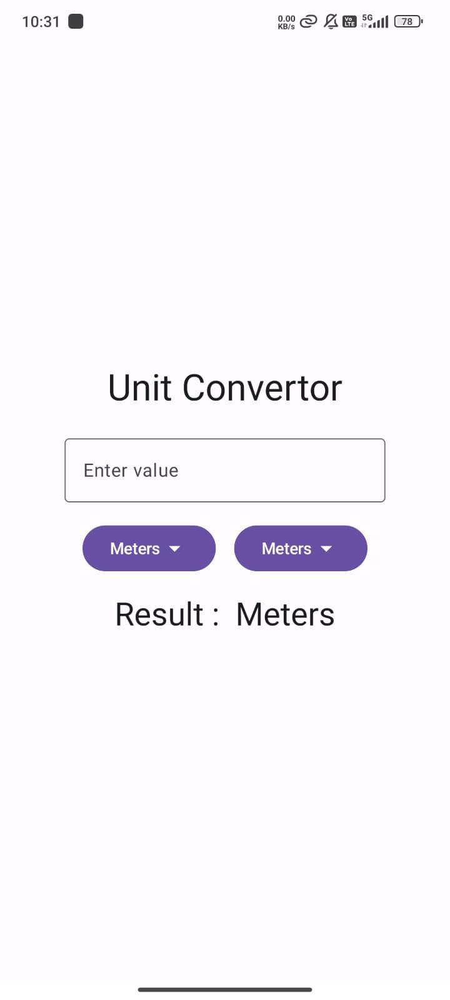

# Unit Converter App

This simple Android app, built with Jetpack Compose, allows you to easily convert between different units of measurement.

## Features

- Convert between various units of length, including:
  - Centimeters
  - Meters
  - Feet
  - Millimeters
- Intuitive and user-friendly interface.
- Real-time conversion as you type.
- Clear display of input, output, and selected units.

## How to Use

1. Enter the value you want to convert in the input field.
2. Select the input unit from the dropdown menu.
3. Select the desired output unit from the dropdown menu.
4. The converted value will be displayed instantly.

### Screenshots

## Built With

- Jetpack Compose
- Kotlin
- Material Design 3

## Future Enhancements

- Support for more unit types (e.g., weight, temperature, volume).
- Improved UI/UX with more interactive elements.
- Offline functionality.

## Contributions

Contributions are welcome! Feel free to submit pull requests for bug fixes, new features, or UI improvements.

